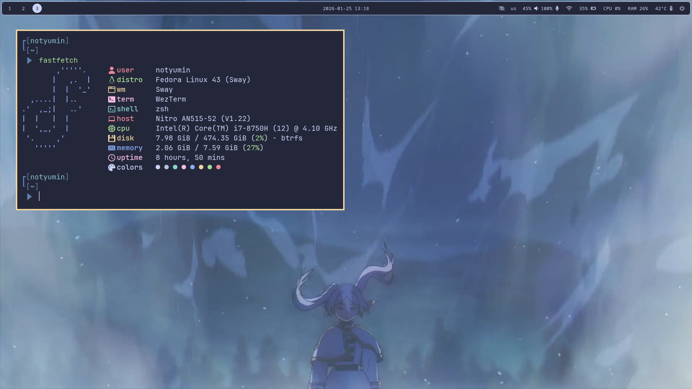
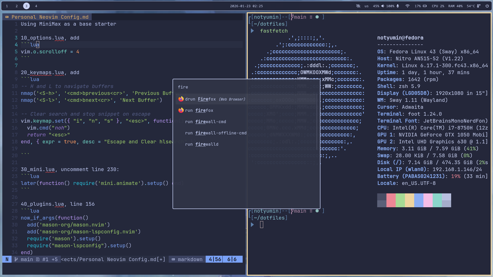

# My Setup

I have 2 main workstation setups:
1. Macbook Air running MacOS
2. Old laptop running Fedora with Sway




- Editor: Neovim (My own config based on [MiniMax](https://nvim-mini.org/MiniMax/))
- Shell: zsh with [Oh My Posh](https://github.com/JanDeDobbeleer/oh-my-posh)
- Terminal: [Wezterm](https://github.com/wez/wezterm) and [Foot](https://codeberg.org/dnkl/foot)
- Multiplexor: [tmux](https://github.com/tmux/tmux)
- Colorscheme: Mostly Tokyonight Storm and Catppuccin Macchiato

Dots managed by [GNU Stow](https://www.gnu.org/software/stow/)

# Installation

Just clone this repo into your home directory, cd in and run `stow` on what you want to install, for example:

```
stow zsh
```

This symlinks all the files in the "zsh" directory to your machine

If you see the following error

```
WARNING! stowing zsh would cause conflicts:
...
```

Instead run
```
stow zsh --adopt
```
This will move any conflicting files into this repo before symlinking.
From there, either:
1. `git restore` if you want to keep the file from this repo

OR

2. `git commit` if you want to keep the file originally on your machine.

# Dependencies
Here's a list of programs I use in my setups

   General:
   | Package | Purpose |
   | --- | --- |
   | [Git](https://git-scm.com/install/) | Used to install many packages |
   | [asdf](https://asdf-vm.com/guide/getting-started.html#_1-install-asdf) | Version manager (for Neovim, node, etc.) |
   | [Neovim](https://github.com/richin13/asdf-neovim) | My text editor of choice |
   | [tmux](https://github.com/tmux/tmux/wiki/Installing) | My terminal multiplexor of choice |
   | [tpm](https://github.com/tmux-plugins/tpm?tab=readme-ov-file#installation) | Plugin manager for tmux |
   | [Wezterm](https://wezterm.org/installation.html) | Terminal emulator of choice |
   | [lazygit](https://github.com/jesseduffield/lazygit?tab=readme-ov-file#installation) | Terminal Git UI |
   | GNU Stow | symlink manager, for dotfiles |
   | [Yazi](https://yazi-rs.github.io/docs/installation/) | Terminal file manager |

   Needed for `.zshrc`:
   | Package | Purpose |
   | --- | --- |
   | [zsh](https://github.com/ohmyzsh/ohmyzsh/wiki/Installing-ZSH) | My shell of choice |
   | [zsh-autosuggestions](https://github.com/zsh-users/zsh-autosuggestions/blob/master/INSTALL.md) | Fish-like suggestions for zsh |
   | [zsh-vi-mode](https://github.com/jeffreytse/zsh-vi-mode?tab=readme-ov-file#%EF%B8%8F-installation) | Better vi mode for zsh |
   | [zsh-syntax-highlighting](https://github.com/zsh-users/zsh-syntax-highlighting/blob/master/INSTALL.md) | Syntax highlighting for zsh |
   | [Oh My Posh](https://ohmyposh.dev/docs/installation/macos) | Prompt Engine |
   | [zoxide](https://github.com/ajeetdsouza/zoxide?tab=readme-ov-file#installation) | Better cd |
   | [fzf](https://github.com/junegunn/fzf#installation) | Fuzzy finder, needed for many other packages |
   | [eza](https://github.com/eza-community/eza/blob/main/INSTALL.md) | Prettier ls |

   Needed for `sway/`:
   | Package | Purpose |
   | --- | --- |
   | [wlogout](https://github.com/ArtsyMacaw/wlogout) | Logout Menu |
   | [Wezterm](https://wezterm.org/installation.html) | Terminal emulator of choice |
   | [rofi](https://github.com/davatorium/rofi/blob/next/INSTALL.md) | Launcher of choice |

# References

- [Setting up Stow](https://www.youtube.com/watch?v=y6XCebnB9gs)
- [Setting up tmux](https://www.youtube.com/watch?v=DzNmUNvnB04)
- [Setting up Aerospace](https://www.josean.com/posts/how-to-setup-aerospace-tiling-window-manager)
- [Setting up Oh My Posh](https://www.youtube.com/watch?v=9U8LCjuQzdc)
- [Setting up Yazi](https://www.youtube.com/watch?v=iKb3cHDD9hw)
